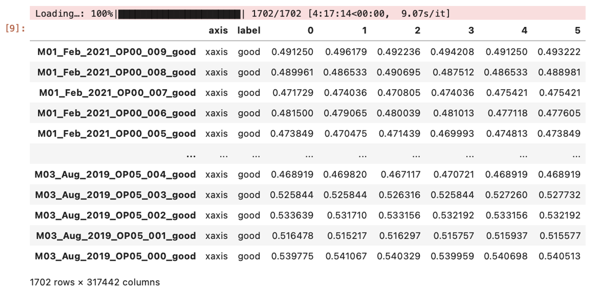
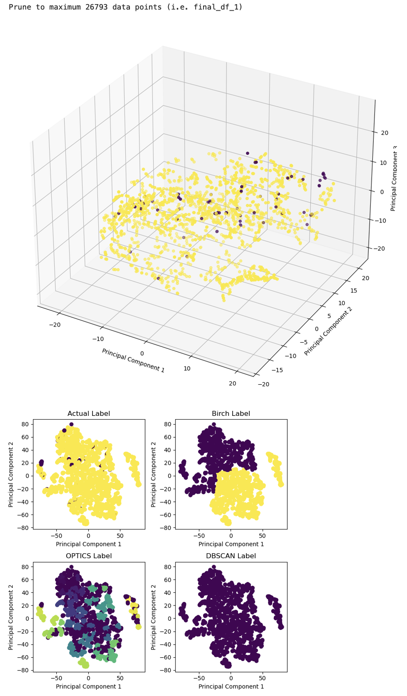

# Time-series_EDA_on_CNC_Vibration_Data
Exploratory Data Analysis (EDA) on time-series vibration data from CNC (Computer Numerical Control) manufacturing machines 

---

I did Exploratory Data Analysis (EDA) on time-series vibration data from CNC (Computer Numerical Control) manufacturing machines whose raw dataset can be seen in [this GitHub LINK](https://github.com/boschresearch/CNC_Machining/tree/main).

Description for the Dataset:
- The dataset in question comprises real-world vibration data from CNC milling machines, collected using a Bosch CISS Sensor, a tri-axial accelerometer. This setup captures data along three axes (X, Y, and Z) at a high sampling rate of 2 kHz, ensuring detailed and high-resolution measurements. The data spans from October 2018 to August 2021, divided into six-month intervals, and includes both normal and anomalous operating conditions, which are clearly labeled for each timeframe.
- Recorded from three different CNC milling machines, each executing 15 distinct processes, the dataset offers a wide variety of machine behaviors and operational contexts. This variability is crucial for developing models that are robust and scalable across different machines and conditions. The detailed labeling and variety of data points make the dataset particularly useful for research in anomaly detection, condition monitoring, and predictive maintenance.

Explanation for Pandas features employed in said Jupyter notebook who are primarily used to handle and manipulate dataframes. 
1. Creating DataFrames:
    - `pd.DataFrame()`: This function is used to create a new DataFrame object. It is frequently used to convert arrays or other data structures into a Pandas DataFrame. For instance, df = pd.DataFrame(h5py.File(filepaths[numfile],'r')['vibration_data']) converts HDF5 file data into a DataFrame.
2. Data Selection and Filtering:
    - `.columns`: This property is used to set or retrieve the column names of a DataFrame. In the script, column names are set after loading data from files, such as df.columns = ['xaxis', 'yaxis', 'zaxis'].
    - `.loc[]`: This function is used for label-based indexing, which means selecting data by the label of the rows and columns. For example, final_df.loc[:,0:268287] selects columns by column index range.
3. Data Transformation and Manipulation:
    - `.values`: This property is used to get a Numpy representation of the DataFrame, often before performing some type of numerical operation.
    - `.T`: This property transposes the index and columns of the DataFrame, which is useful when you need to switch the dimensionality or orientation of the DataFrame.
    - `pd.concat()`: This function is used to concatenate Pandas objects along a particular axis with optional set logic along the other axes. It can also be used to combine several DataFrames into one. For example, final_df = pd.concat([final_df, df], axis=0) appends the data from df to final_df.
4. Handling Missing Data:
    - `.isnull().sum().sum()`: This method chain is used to count the total number of missing values across the entire DataFrame.
5. File I/O:
    - `pd.read_hdf()`: This function reads data from an HDF5 file into a DataFrame. For example, final_df = pd.read_hdf('final_df.h5', 'stage').
    - `pd.to_hdf()`: This method writes a DataFrame to an HDF5 file. For example, final_df.to_hdf('final_df.h5', key='stage', mode='w').
6. Indexing and Assignment:
    - `.index`: This attribute is used to get or set the index (row labels) of the DataFrame. It’s modified to set custom indices based on file paths or other attributes.
    - Inserting columns: df.insert(loc, column, value) is used to insert a column in the DataFrame at a specified location. It’s used for adding 'Machine' and 'Process' as new columns in the DataFrame.
7. Data Aggregation and Descriptive Statistics:
    - `.shape`: This attribute returns a tuple representing the dimensionality of the DataFrame. It is used for getting the number of rows and columns in a DataFrame.

Few results of Pandas feature utilization can be seen in subsequent paragraphs.

Time-series vibration data on X-axis is transposed for each sample so that rows indicate samples while columns indicate timestamps. Afterwards, the last 1000 data points for each sample is replicated to ensure equal sequence length for all samples. 

Visualization of Pandas dataframe using Matplotlib, combined with t-SNE dimensionality reduction technique and various clustering algorithms.

